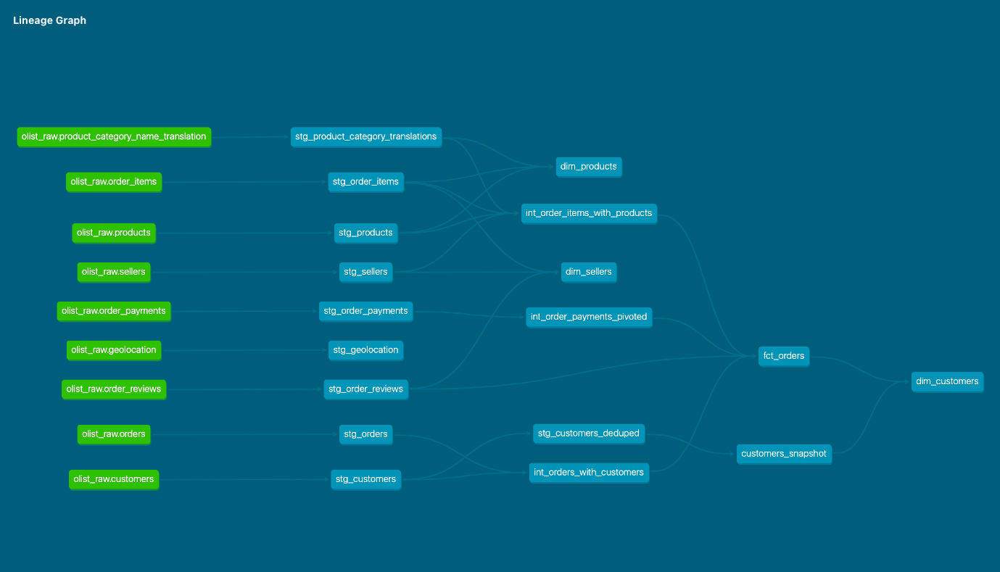

# Olist dbt + Snowflake Pipeline

End-to-end ELT pipeline built on the Brazilian e-commerce Olist dataset using dbt Core, Snowflake, and Dagster.

## Architecture
```
Kaggle CSVs (local)
      ↓
Snowflake Internal Stage (PUT command)
      ↓
Raw Tables (COPY INTO)
      ↓
dbt Core
  ├── staging/        → clean, renamed, typed (views)
  ├── intermediate/   → joins, business logic (views)
  └── marts/          → final analytics tables (tables)
      ↓
Dagster (orchestration + scheduling)
      ↓
BI Tool / Dashboard
```

## Tech Stack

| Layer | Tool |
|---|---|
| Data Warehouse | Snowflake (AWS ap-southeast-1) |
| Transformation | dbt Core 1.11 |
| Orchestration | Dagster 1.12 |
| Source Data | Olist E-Commerce (Kaggle) |
| Language | Python 3.10, SQL |
| Version Control | GitHub |

## Project Structure
```
olist_pipeline/
├── models/
│   ├── staging/           # 9 source-aligned views + deduped customers
│   ├── intermediate/      # 3 business logic models
│   └── marts/             # 4 dimensional models (tables)
├── snapshots/
│   └── customers_snapshot.sql   # SCD Type 2 on customer location
├── macros/
│   └── generate_schema_name.sql # clean schema naming for dev/prod
├── tests/
├── olist_dagster/         # Dagster orchestration project
│   └── olist_dagster/
│       ├── assets.py      # dbt assets auto-discovered from manifest
│       ├── schedules.py   # daily 6am schedule
│       ├── project.py     # dbt project reference
│       └── definitions.py # Dagster entry point
└── assets/
    └── screenshots/       # DAG lineage screenshots
```

## Data Model

### Raw Layer (OLIST_DB.RAW)
One table per source CSV, loaded via Snowflake internal stage.

| Table | Rows |
|---|---|
| customers | 99,441 |
| orders | 99,441 |
| order_items | 112,650 |
| order_payments | 103,886 |
| order_reviews | 99,224 |
| products | 32,951 |
| sellers | 3,095 |
| geolocation | 1,000,163 |
| product_category_name_translation | 71 |

### Staging Layer (OLIST_DB.STAGING)
One view per source table with cleaned column names, renamed fields, and correct types.

### Intermediate Layer (OLIST_DB.INTERMEDIATE)
| Model | Description |
|---|---|
| `int_orders_with_customers` | Orders enriched with customer info + delivery metrics |
| `int_order_items_with_products` | Order items enriched with product, category, seller |
| `int_order_payments_pivoted` | One row per order with payment breakdown by type |

### Marts Layer (OLIST_DB.MARTS)
| Model | Type | Description |
|---|---|---|
| `fct_orders` | Incremental table | Order facts with payment, delivery, review metrics |
| `dim_customers` | Table | Unique customers with lifetime value + segmentation |
| `dim_products` | Table | Products with category translation + sales metrics |
| `dim_sellers` | Table | Sellers with performance metrics + tier classification |

### Snapshot (OLIST_DB.SNAPSHOTS)
| Snapshot | Strategy | Description |
|---|---|---|
| `customers_snapshot` | check | SCD Type 2 tracking customer location changes |

## Key Features

**Incremental model** — `fct_orders` uses merge strategy, only processing new orders on each run. Full refresh available via `--full-refresh` flag.

**SCD Type 2** — `customers_snapshot` tracks historical changes to customer city, state, zip code. `dim_customers` refs snapshot filtered to current records.

**Dev/Prod targets** — isolated environments via `profiles.yml`:
- `dev` writes to `DEV_KARAWORK_*` schemas — safe sandbox
- `prod` writes to clean `STAGING/INTERMEDIATE/MARTS` schemas

**generate_schema_name macro** — overrides dbt default to produce clean schema names per environment.

## DAG Lineage



## Testing

81 tests across all layers:
- Primary key uniqueness
- Not null constraints  
- Accepted values validation
- 3 known data quality warnings (775 orders with no items, 610 products missing English translation)

## Dagster Orchestration

All 18 dbt assets (17 models + 1 snapshot) are auto-discovered from `manifest.json` and visible in the Dagster UI.

Daily schedule runs `dbt build` at 6am via `build_schedule_from_dbt_selection`.

To run locally:
```bash
cd olist_dagster
dagster dev
# open http://127.0.0.1:3000
```

## Setup

### Prerequisites
- Snowflake account (Standard edition)
- dbt Core 1.11+
- Python 3.10+
- Dagster 1.12+

### Quick Start
```bash
# Clone repo
git clone https://github.com/whysokara/olist-dbt-snowflake-pipeline.git
cd olist-dbt-snowflake-pipeline

# Configure Snowflake connection
vi ~/.dbt/profiles.yml

# Validate connection
dbt debug

# Load raw data (one time)
# Follow Snowflake setup in docs/setup.md

# Run all models
dbt run

# Run tests
dbt test

# Or run everything together
dbt build

# Start Dagster UI
cd olist_dagster
dagster dev
```

## Environments

| Target | Schemas | Triggered by |
|---|---|---|
| `dev` | `DEV_KARAWORK_*` | Developer manually |
| `prod` | `STAGING / INTERMEDIATE / MARTS` | Dagster schedule |

## Author

Kara — [LinkedIn](https://linkedin.com/in/himanshukara) · [GitHub](https://github.com/whysokara) · [Medium](https://medium.com/@whysokara)